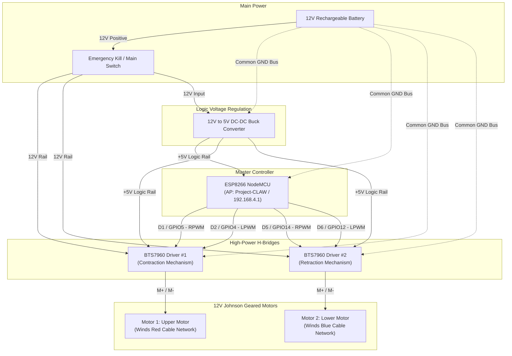

# Project CLAW — Circuit Diagram & Electrical Schematic

This document provides visual diagrams and wiring schematics for **Project CLAW** using the **NodeMCU ESP8266**, **2× BTS7960 motor drivers**, and **2× Johnson 12V DC gearmotors**.

---

## 1. System Block Diagram (Mermaid)



---

## 2. Complete Physical Wiring Schematic (ASCII)

```text
====================================================================================================
                                      PROJECT CLAW CIRCUIT DIAGRAM
====================================================================================================

               +12V
  [ 12V BATT (+) ] ──────[ MAIN TOGGLE / KILL SWITCH ]
                                  │
                                  ├───────────────────────────┬───────────────────────────┐
                                  │                           │                           │
                                  ▼                           ▼                           ▼
                           +--------------+            +--------------+            +--------------+
                           |  BUCK CONV   |            |  BTS7960 #1  |            |  BTS7960 #2  |
                           |   IN (+)     |            |   B+ / VCC   |            |   B+ / VCC   |
                           +--------------+            +--------------+            +--------------+
                                  │                           │                           │
                                [BUCK]                        │                           │
                             12V -> 5V                        │                           │
                                  │                           │                           │
                           +--------------+                   │                           │
                           |  BUCK CONV   |                   │                           │
                           |   OUT (+)    |                   │                           │
                           +--------------+                   │                           │
                                  │ (+5V)                     │                           │
                 ┌────────────────┼────────────────┐          │                           │
                 │                │                │          │                           │
                 ▼                ▼                ▼          │                           │
          +--------------+  +-----------+    +-----------+    │                           │
          |   ESP8266    |  |BTS7960 #1 |    |BTS7960 #2 |    │                           │
          |   VIN / 5V   |  |VCC (Pin 7)|    |VCC (Pin 7)|    │                           │
          +--------------+  |R_EN(Pin 3)|    |R_EN(Pin 3)|    │                           │
                            |L_EN(Pin 4)|    |L_EN(Pin 4)|    │                           │
                            +-----------+    +-----------+    │                           │
                                                              │                           │
  ────────────────────────────────────────────────────────────┼───────────────────────────┼─────────
  PWM CONTROL SIGNALS:                                        │                           │
                                                              │                           │
   ESP8266 NodeMCU                                            │                           │
  +-------------------------+                                 │                           │
  |                         |                                 │                           │
  |  D1 (GPIO 5)  ──────────┼───────────────────────► RPWM    │                           │
  |  D2 (GPIO 4)  ──────────┼───────────────────────► LPWM    │                           │
  |                         |                       (BTS7960 #1)                          │
  |                         |                                                             │
  |  D5 (GPIO 14) ──────────┼───────────────────────────────────────────────────► RPWM    │
  |  D6 (GPIO 12) ──────────┼───────────────────────────────────────────────────► LPWM    │
  |                         |                                                   (BTS7960 #2)
  +-------------------------+
                                                              │                           │
  ────────────────────────────────────────────────────────────┼───────────────────────────┼─────────
  MOTOR OUTPUTS:                                              │                           │
                                                        +-----+-----+               +-----+-----+
                                                        | BTS7960 #1|               | BTS7960 #2|
                                                        | M+     M- |               | M+     M- |
                                                        +-----+--+--+               +-----+--+--+
                                                              │  │                        │  │
                                                              ▼  ▼                        ▼  ▼
                                                        [ MOTOR 1 ]                 [ MOTOR 2 ]
                                                      12V Johnson 100RPM          12V Johnson 100RPM
                                                        (Contraction)                (Retraction)
                                                         [Red Cable]                 [Blue Cable]

  ──────────────────────────────────────────────────────────────────────────────────────────────────
  COMMON GROUND SYSTEM (GND):
  
  [ 12V BATT (-) ] ──┬──► BUCK CONV [ IN (-) ] & [ OUT (-) ]
                     ├──► ESP8266 [ GND ]
                     ├──► BTS7960 #1 [ B- / GND ] (Power Terminal)
                     ├──► BTS7960 #1 [ GND ] (Logic Header Pin 8)
                     ├──► BTS7960 #2 [ B- / GND ] (Power Terminal)
                     └──► BTS7960 #2 [ GND ] (Logic Header Pin 8)
====================================================================================================
```

---

## 3. BTS7960 (IBT-2) Module Header Close-Up

```text
           +----------------------------------------+
           |       BTS7960 (IBT-2) MODULE           |
           |                                        |
           |  [ B+ ]  [ B- ]      [ M+ ]   [ M- ]   |  <-- Heavy Screw Terminals
           |   12V     GND        Motor+   Motor-   |      (Use 16-18 AWG Wire)
           |                                        |
           |   8-Pin Logic Header:                  |
           |   [1] RPWM   <-- ESP8266 PWM           |
           |   [2] LPWM   <-- ESP8266 PWM           |
           |   [3] R_EN   <-- Jumper to +5V (Enable)|
           |   [4] L_EN   <-- Jumper to +5V (Enable)|
           |   [5] R_IS   <-- Leave Unconnected     |
           |   [6] L_IS   <-- Leave Unconnected     |
           |   [7] VCC    <-- +5V from Buck         |
           |   [8] GND    <-- Common GND            |
           +----------------------------------------+
```

---

## 4. Quick Connection Check Table

| From Component & Pin | To Component & Pin | Wire Function | Wire Gauge |
|---|---|---|:---:|
| **12V Battery (+)** | Main Switch Input | Main Battery Feed | 16–18 AWG |
| **Main Switch Output** | Buck Converter `IN (+)` | 12V to Step-Down | 20–22 AWG |
| **Main Switch Output** | BTS7960 #1 `B+ / VCC` | Motor 1 12V Power | 16–18 AWG |
| **Main Switch Output** | BTS7960 #2 `B+ / VCC` | Motor 2 12V Power | 16–18 AWG |
| **Buck Converter `OUT (+)`** | ESP8266 `VIN` / `5V` | Regulated 5V to MCU | 22–24 AWG |
| **Buck Converter `OUT (+)`** | BTS7960 #1 & #2 `VCC` | Logic chip supply | 24–26 AWG |
| **Buck Converter `OUT (+)`** | BTS7960 #1 & #2 `R_EN` & `L_EN` | Drivers Enable High | 24–26 AWG |
| **ESP8266 `D1` (GPIO5)** | BTS7960 #1 `RPWM` | Motor 1 Contract/Pull | 24–26 AWG Dupont |
| **ESP8266 `D2` (GPIO4)** | BTS7960 #1 `LPWM` | Motor 1 Reverse | 24–26 AWG Dupont |
| **ESP8266 `D5` (GPIO14)** | BTS7960 #2 `RPWM` | Motor 2 Retract/Pull | 24–26 AWG Dupont |
| **ESP8266 `D6` (GPIO12)** | BTS7960 #2 `LPWM` | Motor 2 Reverse | 24–26 AWG Dupont |
| **BTS7960 #1 `M+ / M-`** | Johnson Motor 1 | Contraction Actuator | 16–18 AWG |
| **BTS7960 #2 `M+ / M-`** | Johnson Motor 2 | Retraction Actuator | 16–18 AWG |
| **All Negative Lines** | **Common Ground Bus (GND)** | Shared Reference GND | 16–18 AWG main |
